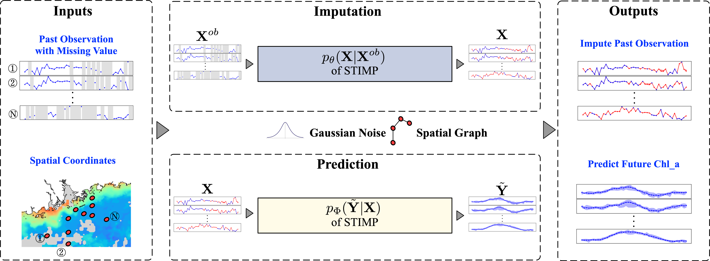

=====
Usage
=====

Pipeline overview
------------

STIMP is a deep learning-based method that accurately imputes and predicts Chl_a in the coastal oceans. The inputs for STIMP include observations of Chl_a from coastal oceans, denoted as  :math:`\mathbf{X}^{ob}`, 
and a spatial graph, :math:`\mathbf{G}`, that contains the geographic coordinates of the observations. STIMP simultaneously outputs a complete Chl_a dataset, 
:math:`\mathbf{X}`, and accurately predicts Chl_a, :math:`\tilde{\mathbf{Y}}`, based on :math:`\mathbf{X}`. STIMP and is formulated as:

.. math:: p(\tilde{\mathbf{Y}}|\mathbf{X}^{ob})=\int_{\mathbf{X}}p_\Phi(\tilde{\mathbf{Y}}|\mathbf{X})p_\theta(\mathbf{X}|\mathbf{X}^{ob})d\mathbf{X}.

Prepare data
------------
All data used in this work are publicly available through online sources. The chlorophyll-a observation datasets were 8-day averaged Level 3 mapped products from Moderate Resolution Imaging Spectroradiometer (MODIS) Aqua projects with a spatial resolution of 4 km 
`MODIS <https://search.earthdata.nasa.gov/search?q=10.5067/AQUA/MODIS/L3M/CHL/2022>`_. You can select the data with **\*.8D.\*.4km.nc** as filter. 

We also uploaded the datasets on Zenodo at https://doi.org/10.5281/zenodo.14724760. Then, 

.. code-block:: bash

   mv data.zip /path/to/STIMP/
   unzip e data.zip

`Prepare the dataset from the raw data <https://github.com/YangLabHKUST/STIMP/blob/release/tutorials/01-preprocess_chla_data.ipynb>`_ We generate the 4 datasets, including Pearl River Estuary, the Northern of Mexico, Chesapeake Bay and Yangtze River Estuary, following this tutorials. 
The generated datasets are also included in the data.zip

Imputation process
------------
The imputation step intends to reconstruct multiple potential complete spatiotemporal Chl_a distributions from partial observations. Due to the collected remote sensing Chl_a data
does not contain ground truth for unobserved data, we can ramdomly select part of observation as imputation target to train the imputation function :math:`p_\theta(\mathbf{X}|\mathbf{X}^{ob})`.

.. code-block:: bash

   python imputation/train_stimp.py --missing_ratio A --area B 
   # A indicates how many observations are chosen as the imputation target
   # B is selected representative coastal ocean area, including PRE, MEXICO, Chesapeake and Yangtze

We also provide the script for training the baselines, including ``DINEOF`` :cite:p:`alvera2007multivariate,ma2021two`, ``CSDI`` :cite:p:`tashiro2021csdi`, ``ImputeFormter`` :cite:p:`nie2024imputeformer`, ``Inpainter`` :cite:p:`yun2023imputation`,
 ``Lin-itp``, ``MaskedAE`` :cite:p:`he2022masked`, ``Slide window`` and ``TRMF`` :cite:p:`yu2016temporal`. 
To assess the performance of STIMP, we randomly selected nine different rates of missing data, ranging from 10% to 90%, for choosing observed data as imputation targets.
The experiments in the four coastal ocean regions, including Pearl River Estuary, Northern Gulf of Mexico, Chesapeake Bay and Yangtze River Estuary, can be conducted using the following script.

.. code-block:: bash

   for area in {"PRE","MEXICO","Chesapeake","Yangtze"}
      for i in {0.1,0.2,0.3,0.4,0.5,0.6,0.7,0.8,0.9}
      do
         python imputation/train_stimp.py --missing_ratio $i --area $area
         python imputation/train_csdi.py --missing_ratio $i --area $area
         python imputation/train_dineof.py --missing_ratio $i --area $area
         python imputation/train_imputeformer.py --missing_ratio $i --area $area
         python imputation/train_inpainter.py --missing_ratio $i --area $area
         python imputation/train_lin_itp.py --missing_ratio $i --area $area
         python imputation/train_mae.py --missing_ratio $i --area $area
         python imputation/train_mean.py --missing_ratio $i --area $area
         python imputation/train_trmf.py --missing_ratio $i --area $area
      done

Prediction process
------------

According to Rubin's rules :cite:p:`rubin2004multiple`, the final Chl_a prediction is obtained by averaging the outcomes of multiple imputation and prediction processes.
Step.1 
-----------------------

Generate multiple imputation for Chl_a:

.. code-block:: bash

   for area in {"PRE","MEXICO","Chesapeake","Yangtze"}
   do
      python dataset/generate_data_with_stimp.py --area PRE
   done

Reference
------------

.. bibliography::
    :filter: {"usage"} & docnames